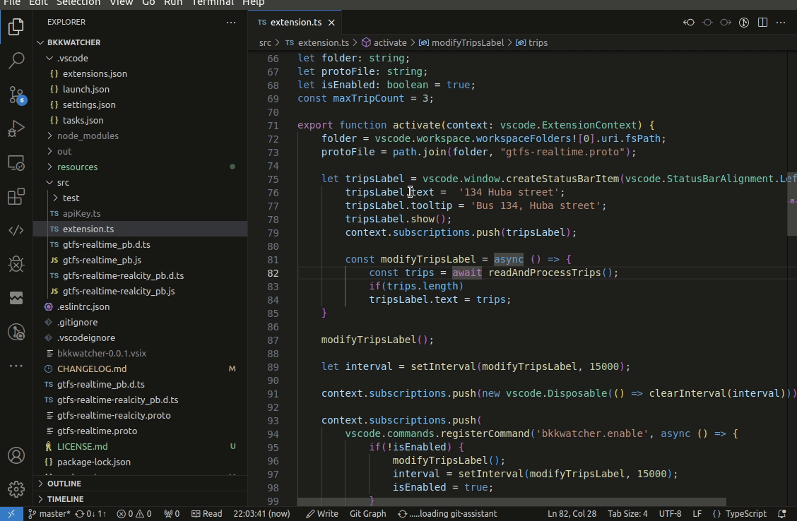

# BKK Watcher

Megjeleníti a status bar-on hogy mikor jön legközelebb az adott megállóból az adott járat.



### Fontos
Az extension használatához létre kell hozni az apiKey.ts fájlt a src mappában, aminek a saját API kulcsodat kell tartalmaznia az alábbi formátumban:

```TS
export const apiKey = 'A te API kulcsod';
``` 
Az API kulcs az alábbi linken igényelhető:

https://opendata.bkk.hu/keys
